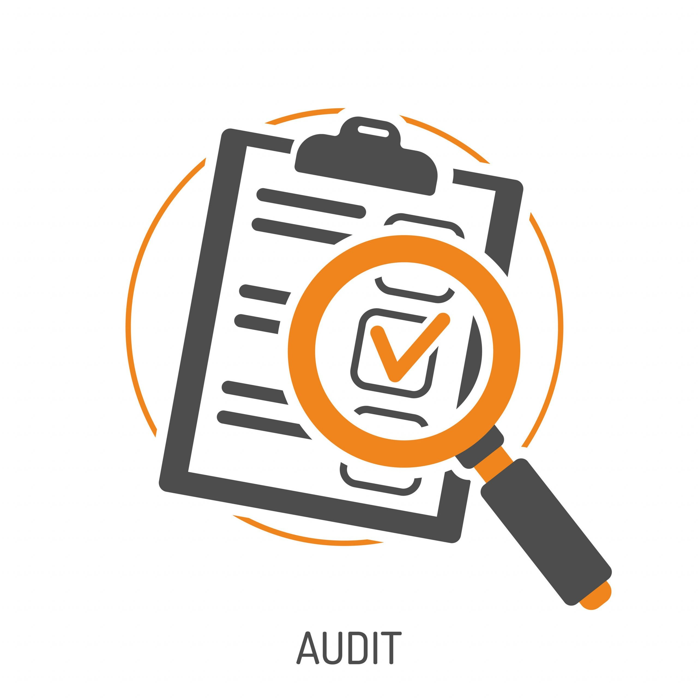

# Botium-Toys-Audit

A cybersecurity internal audit project for Botium Toys.

# Botium Toys Internal IT Audit

## Project Overview
This project involves conducting an internal IT audit for Botium Toys, a fictional company, to assess its cybersecurity posture, compliance with relevant standards, and potential risks.

## Key Deliverables
- **Controls and Compliance Checklist:** A comprehensive review of controls in place.
- **Summary Report:** Findings, compliance status, and recommendations for improvement.

## Tools and Frameworks
- **Framework:** NIST Cybersecurity Framework (CSF)
- **Tools:** Manual assessment and documentation.

## Files in This Repository
- Controls-and-Compliance-Checklist.pdf: Completed checklist.
- Summary-Report.md: Overview of audit findings and recommendations.
- Supporting-Materials/: Reference documents.

## Learn More
For further details, visit the project page on [Google Sites](<insert-link-here>).
